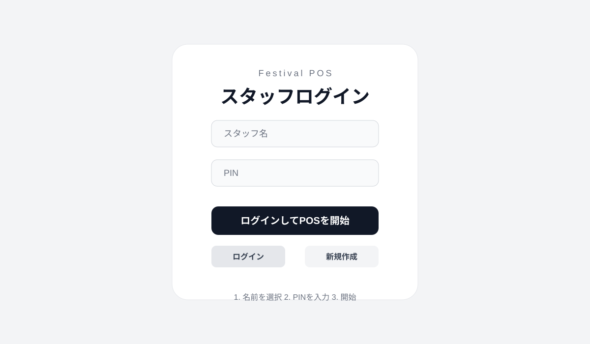
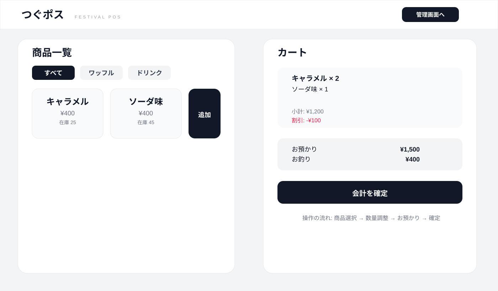
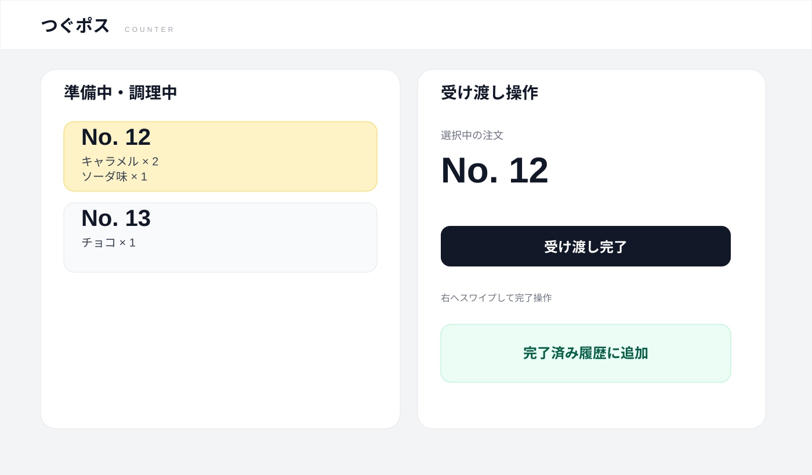
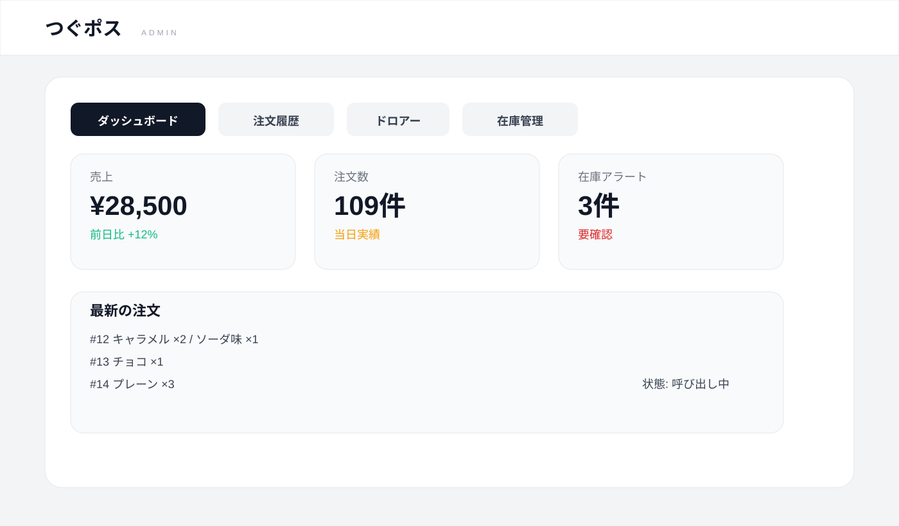

# つぐポス スタッフ向けマニュアル

このマニュアルは、文化祭や模擬店で実際にスタッフが使うための運用説明書です。画面の見方と、1日の流れをイメージしながら使えるように整理しています。

---

## 1. まずはじめに

「つぐポス」は、レジ会計・受け渡し管理・売上確認をまとめて行える POS システムです。スタッフはログインして商品を選び、会計を完了し、受け渡しカウンターで商品を渡します。

### 主な利用者
- レジ担当
- 受け渡し担当
- 管理者

### 1日での流れ
1. スタッフログイン
2. 商品を選んで注文
3. お会計を完了
4. 受け渡しカウンターで受け取り確認
5. 管理画面で売上確認

---

## 2. スタッフログイン

### 画面イメージ

### 操作手順
1. アプリを起動する
2. スタッフ名を選ぶ
3. PIN を入力する
4. 「ログインしてPOSを開始」を押す

### 注意事項
- PIN は 4〜6 桁の数字で入力します
- 管理者作成は別の管理用 PIN が必要です
- ログインできない場合は、スタッフ名と PIN を確認してください

### 新規スタッフ登録
- 「新規作成」タブを選ぶ
- 表示名、ログイン名、PIN、役割を入力する
- 管理者アカウント作成時は管理者設定 PIN を入力する

---

## 3. レジ画面の操作

### 画面イメージ

### 3-1. 商品を選ぶ
- 画面左側に商品一覧が表示されます
- 「すべて」「ワッフル」「ドリンク」で分類を切り替えられます
- 商品を押すとカートに追加されます

### 3-2. 数量を調整する
- カート内の商品を増減できます
- 在庫がある範囲で数量を上げられます
- 在庫がなくなった商品は追加できません

### 3-3. 割引の確認
- 2 個以上購入で割引が自動で反映されます
- クーポン利用時は追加割引が適用されます
- 画面の合計金額が自動で更新されます

### 3-4. お預かり金額を入力する
- キーパッドで金額を入力します
- 「BS」ボタンで 1 桁ずつ削除できます
- お釣りは自動計算されます

### 3-5. 会計を完了する
1. 商品と合計金額を確認する
2. お預かり金額とお釣りを確認する
3. 会計確定を押す
4. レシート画面が表示される

### 3-6. レシートについて
- QRコード付きの電子レシートが発行されます
- 印刷・保存・共有が可能です
- 顧客に会計内容を確認してもらうときに使います

---

## 4. 受け渡しカウンターの使い方

### 画面イメージ

### 画面の見方
- 左側: 準備中・調理中の注文一覧
- 右側: 選ばれた注文の確認と完了操作
- 注文番号を選ぶと詳細が表示されます

### 操作手順
1. 準備中の注文番号を選ぶ
2. 商品内容を確認する
3. 右へスワイプまたは完了操作を実行する
4. 完了済み履歴に移動する

### 注意事項
- お渡し前に注文内容を再確認してください
- 受け取り済みの注文は完了状態に切り替えます
- 間違えて完了にすると、再度元に戻す必要があります

---

## 5. 管理画面の使い方

### 画面イメージ

### 管理画面でできること
- 注文履歴の確認
- 売上の確認
- 在庫状況の確認
- ドロアー点検（現金確認）
- 注文ステータスの変更

### 役割別の使い分け
- レジ担当: 会計と注文の確認
- 受け渡し担当: 商品の受け渡し完了
- 管理者: 売上・在庫・注文の総合管理

---

## 6. オフライン時の運用

### 動作について
- ネットワークが切れていても注文は一時保存されます
- 接続が戻ると自動で同期されます
- そのため、現場での販売を止めずに運営できます

### 重要な確認ポイント
- オフライン中に受け渡しが完了しても、最終的な注文確認は再接続後に行う
- 同期が完了しているかを確認してから、棚卸しや売上確認を進める

---

## 7. よくあるトラブル

### ログインできない
- PIN を確認する
- スタッフの有効状態を確認する
- 必要なら新規作成を行う

### 会計が保存されない
- ネットワーク接続を確認する
- ブラウザを再読み込みして状態を確認する
- 一時保存済みの注文があれば、回線回復後に同期される

### 管理者で作成できない
- 管理者用 PIN が設定されているか確認する
- PIN の入力が一致しているか確認する

---

## 8. 当日の運用の基本ルール

- スタッフごとに自分のアカウントを使う
- PIN は他人に見せない
- 会計後はレシート内容を確認する
- 受け渡し担当は注文番号の照合を必ず行う
- 管理画面では在庫と売上を定期的に確認する

---

## 9. まとめ

このアプリは、文化祭の模擬店運営に必要な会計・受け渡し・管理を一つの画面で行えるように設計されています。毎回の流れを固定しておくことで、混雑時でもスムーズに対応できます。

基本の順番は次の通りです。

ログイン → 商品選択 → 会計 → 受け渡し → 売上確認

この順番を守ると、現場でのミスを減らしやすくなります。
